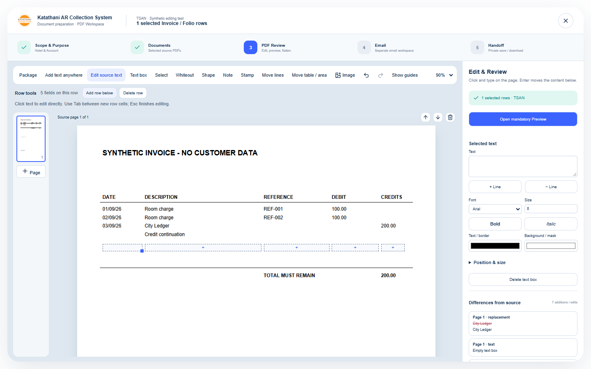
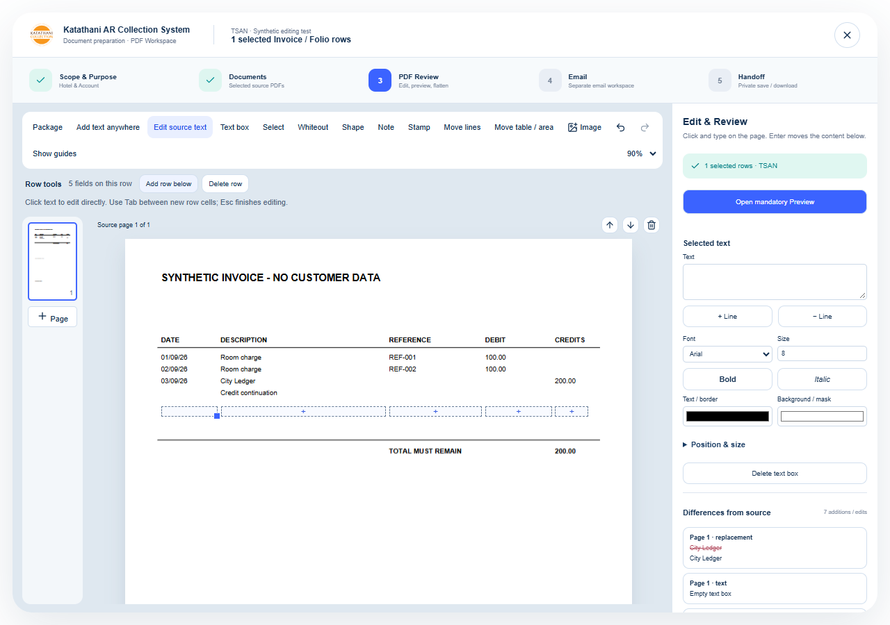

# PDF editing resilience and direct document controls — 21 September 2026

## Scope and current boundary

The owner reports frequent blockers when adding rows, deleting words through all three input paths, and other edits, and wants direct document control rather than managing individual text boxes. A preference question distinguishing fixed-layout PDF editing from Word-style document reflow was sent but was not answered during implementation. The stated default for this increment is direct fixed-layout editing, preserving the existing application design. **This is not a Word conversion, paragraph reconstruction engine, or an unrestricted arbitrary-PDF editor.**

No new dependency, paid library/service, customer PDF fixture, accounting mutation, storage retention change or email operation. The existing PDF.js/pdf-lib renderer, source originals, identity validation, opaque edited-page export, mandatory final Preview and exact reviewed-byte handoff remain. BentoPDF is not integrated.

## Implemented

- Complete the recognized Date / Description / Reference / Debit / Credit invoice schema from its header and nearby body rows, so sparse rows retain blank columns. New cells use the available column width and normal editable font settings rather than inheriting a source word's limited glyph subset. Other table formats retain their existing row interpretation.
- Keep description continuations at up to two font-size units of leading within a logical row, respecting column/style and rule boundaries. A new row follows the continuation instead of separating it from its parent.
- Measure actual supported source-glyph ink at higher measurement precision for row boundaries. Keep conservative geometry when source glyphs cannot be measured. Check both preceding and following content before deleting a row.
- Use original ink bounds for supported-text erasure, even when the replacement font changed. This avoids erasing the top of the next tightly spaced text line. Source identity/mask ownership remains validated before painting.
- Empty text needs no glyph/font rendering. Clearing unsupported source text through Backspace or the sidebar can therefore be previewed/exported, just like deleting its text box. Unsupported nonempty source text still needs an explicit available replacement font.
- New rows focus their first field, accept Tab/Shift+Tab navigation, wrap long entries inside their column, and keep sibling cells together when expanding. Focus is applied after the busy/inert editing state clears, avoiding an observed timing race.
- Partial area selection expands to include whole touched text/objects before moving. A no-op Remove empty lines action is an informational status rather than a red error. Undo/Redo clear an error belonging to the reverted state.
- Add text at a clicked position with **Add text anywhere**; Esc exits editing/placement. Source guides are hidden until hover/focus by default, with **Show guides** available. **Package** can be collapsed to widen the paper. Row commands sit above the paper; Preview remains visible near the top of the formatting sidebar. Existing detailed text/format/position controls remain available.

## Reproductions and verification

Original failing command: `node node_modules/vitest/vitest.mjs run tests/pdf-editor-resilience.test.ts`.

- A five-column sparse row produced `[20,90,360]` rather than `[20,90,200,300,360]`.
- Clearing a native text value still threw `SourceFontError` despite no glyph needing to be drawn.
- A 14pt description continuation was excluded from its logical 8pt invoice row.

Browser regressions use `tests/browser/editor-resilience/harness.html`, an entirely synthetic invoice. The dense 8pt/9pt-leading case failed row insertion with the overlap message. Clearing `REF-001` changed **357 pixels** belonging to the following `REF-002`; the fix retains **all** sampled next-word pixels unchanged. The 8pt/8pt-leading exploratory fixture had genuinely overlapping conservative ink extents across columns and was not used to justify removing the overlap guard.

Final verification before deployment:

- Full Vitest: **1,297 tests / 130 files passed**.
- TypeScript, Vite production build, public asset preparation and Wrangler deployment dry run passed. Existing large-chunk advisory retained; no new runtime dependency.
- Full relevant browser suite: **72 cases passed**, covering the 12 new scenarios plus source fonts, source deletion, voucher fields, rows, continuation pages, output redaction, undo, identity/reload, review acknowledgment and handoff locks.
- The new row input/focus case passed five consecutive repeats under three workers after the inert-state focus fix. An obsolete assertion expecting only one plain-text new cell was updated to expect all three, retaining row grouping/count checks.
- Existing continuation preservation now checks painted ink rather than the padded hit-target rectangle. It still checks retained native ink and a present editable source target.
- Inspected both 1440×900 and 1280×900 editor captures. The initial inspection caught a continuation-order issue, now covered by a regression. Final captures show the complete new row below the continuation and above the preserved total. Original tracked reference/evidence files were restored; new evidence uses distinct names.
- Impeccable detector ran once. Its legacy palette/type advisories were assessed against the pinned design; the existing self-hosted Plus Jakarta Sans identity was preserved. The design sidecar was reported stale relative to DESIGN.md; no unrelated design-configuration repair was performed.

## Limits

Only the explicit five-heading invoice pattern gains inferred blank columns; this does not recognize every possible PDF table. Genuine intersecting content, unsupported nonempty source glyphs, oversized edits and source identity failures continue to block unsafe output. Existing source-font replacement remains explicit. No claim that every warning on the owner's private files has been reproduced or eliminated. Word-style paragraph/table reflow remains a separate architectural choice.

## Deployment

Source and production evidence will be appended after the deployment has completed.
