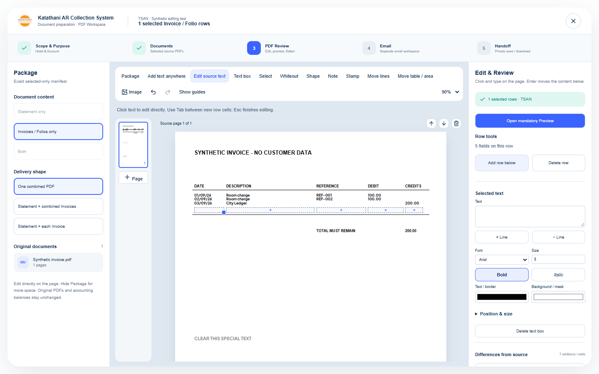
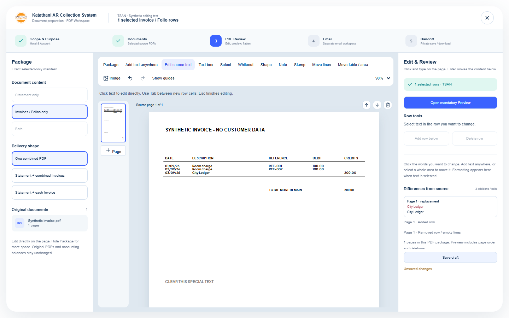

# PDF Workspace lifecycle audit — 21 September 2026

## Scope

The owner reproduced **Add row below → Delete row** failing with the nearby-text/border warning, then requested a detailed review of the whole editor workflow. This audit covers source text editing, inserted/native rows, movement, history/reload, page flow, review and exported bytes. All reproduction PDFs are synthetic. The customer's screenshot was used to identify the operation and layout pattern; its private PDF was not copied or stored in the repository.

## Reproduced problems and fixes

| Problem | Failing evidence | Fix |
| --- | --- | --- |
| A newly inserted empty row cannot be deleted with some embedded fonts | A tall embedded-font fixture reproduced the **exact** nearby-text/border message when deleting from Debit | Added rows own their inserted space. Delete uses that recorded space, not a fresh estimate based on font bounds. New cells start inside that allocation |
| Add/delete does not restore the original layout even when no warning occurs | Standard-font fixture inserted **14.856pt** but removed **9.078pt** when blank or **15.078pt** when filled; **27,836 / 9,393** pixels changed afterwards | Replay row allocations through later edits, include owned typing expansion, and reclaim exact bands in descending order |
| Multiline/repeated rows need stable ownership across reload and other rows | Added workflow tests for two rows, multiline growth, serialization/reload, deletion out of order and toolbar Undo/Redo | Optional insert `rowId` ownership survives validated project restoration. Legacy cell typing spacers remain supported. Another row's allocation is excluded |
| Selecting unchanged special-style source text blocks Preview | Merely selecting an opacity-styled native run produced a source-font error | Preserve the native appearance without redrawing its font when identity, text, position and styling are unchanged. Real edits still validate glyph support; retained native runs remain protected during pagination |
| Whitespace-only edits ask for a replacement font | A source edit containing only spaces/newlines failed Preview | Erasure with no visible text needs no glyph drawing. Identity/mask validation remains |
| Add row after moving a source text element creates no editable cell | The operation added space but yielded zero cell targets | Standalone moved text supplies a one-field row template and a nearby insertion position |
| Delete row after moving source text reveals its old source again | The original target reappeared after deleting the moved row | Retain an explicit deletion mask when the original source is outside the physically deleted band |

If unrelated notes, images or native artwork occupy an added row's space, Delete row removes the row's own cells and retains occupied space, with a neutral status message. It does not erase someone else's content or reject removal of the row's own cells. Original/native row deletion still protects genuinely intersecting source content.

## Verification matrix

| Area | Covered behavior |
| --- | --- |
| Native text | Standard/embedded subsets, bold/italic/color, source identity, unchanged special styles, new supported/unsupported characters, empty/whitespace edits, all three deletion paths |
| Added rows | All five columns, empty/filled Date and Debit, tight total boundary, tall embedded font, repeat insertion, multiline growth, deletion in either order, unrelated-note preservation |
| Geometry/history | 100 seeded histories of 20 add/grow/delete operations, exact source-fragment restoration, legacy ownership, serialization/reload, toolbar Undo/Redo, moved source masks |
| Other tools | Point-and-type text placement, optional guides, partial area selection, native line/area movement, shapes/whiteout/image, font controls, page reorder/delete/add, zoom |
| Output/review | Overflow pages and footer, whole-row/continuation boundaries, native image protection, actual Preview, per-file/per-page acknowledgment, exact-byte handoff locks, late async results, dirty close/draft confirmation |
| Privacy/integrity | Deleted content absent from edited PDF pixels/hidden text/embedded objects, original source bytes retained, independent runtime font scopes, malformed saved project/foreign source rejection |

Final local verification:

- **1,308 unit tests / 132 files passed**, including the 100 seeded histories.
- **90 editor browser cases passed** on one stable final source state. An earlier broad run was interrupted by source hot reload while refinements were still being made; its transient navigation/history failures were not counted as acceptance. The final stable run passed all 90.
- Eight standard/embedded-font × empty/filled × Date/Debit roundtrips restored the complete pre-add raster with **zero differing pixels at 3× scale**.
- Desktop/laptop add→delete→review→export cases passed, retained a single physical page with the same dimensions, and checked total dark-ink preservation at export resolution. Added/deleted captures were visually inspected at 1440 and 1280.
- TypeScript, production build, public assets and deployment dry run passed. No dependency or paid service was added. Existing large-chunk build advisory is unchanged.
- The old unsupported-style test now checks an **actual edited** value still blocks; unchanged selection is separately proven safe. No assertion protecting source identity or deleted-data removal was dropped.

New tests: `tests/pdf-inserted-rows.test.ts`, `tests/pdf-unchanged-source.test.ts`, moved-source cases in `tests/pdf-source-deletion.test.ts`, and `tests/browser/row-lifecycle/pdf-editor.spec.ts`. Production tests additionally exercise the empty/filled embedded-font credit-row add/delete sequence before export Preview.

## Boundaries

No OPERA/accounting/database/retention change, customer PDF test, real email or file cleanup. This is a bounded reproducible audit, not a guarantee for every possible PDF or a Word-style reflow engine. Genuine unsupported nonempty glyphs, invalid source identity, and unsafe native-content intersections remain protected. No user working tab was refreshed or edited.

## Deployment

- Deployed/enabled source **`292255412c17ae7a196e8f009457c368a0c4f7c2`**, Worker **`92e78fb6-f35d-4c22-a70d-87eec54e3dc8`**, at https://ar-workspace.ar-c82.workers.dev using `--keep-vars`.
- Both [source push CI](https://github.com/NTHV9/ar-workspace/actions/runs/35585977982) and [PR CI](https://github.com/NTHV9/ar-workspace/actions/runs/35585984521) passed. [PR56](https://github.com/NTHV9/ar-workspace/pull/56) merged as `06d40993ca436abb81a51c7910f9f126f95b3680`, with an identical complete source tree.
- Production health returned the exact source SHA and `database_verified`; six protected-route anonymous checks passed.
- **Two deployed browser cases passed** at 1440×900 and 1280×800. Each uses a synthetic embedded-font native invoice with a credit row immediately above a total rule: Add row, select Debit, delete (empty at desktop / filled at laptop), assert no warning/no remaining cells and identical total placement, then perform actual exported Preview. This is 92 editor browser scenarios including the 90 local cases.
- The deployed capture was inspected; existing tracked evidence files were restored. No active/private user document tab was accessed or reloaded, no real customer PDF or API data was used in the deployed UI tests, and no mail was sent.
